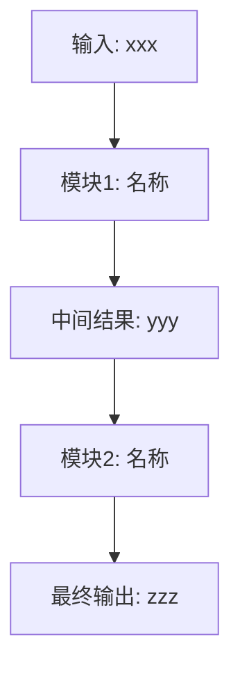

# 精读报告模板与写作要求

报告固定五段，标题层级、顺序不可改。每节先看"要求"，再看骨架。

写作前先完成一份工作笔记，不必放进最终报告：

| 证据项 | 记录内容 |
|---|---|
| 贡献 | 原文贡献声明所在小节/段落 |
| 方法 | Figure / Algorithm / Equation 编号和一句话作用 |
| 实验 | Table / Figure 编号、指标、关键数字 |
| 不足 | Limitation / failure case / future work 或"原文未说明" |

如果论文没有数学推导、没有实验、没有公开图片，仍保留固定五段结构，但明确写"原文未提供"，不要发明内容补齐版面。

---

## 0. 报告头

```markdown
# <论文标题>（<会议/期刊 年份>）

> **一句话总结**：<创新点> + <解决的问题> + <关键结果（带数字）>。

| 项目 | 内容 |
|---|---|
| 作者/机构 | … |
| 来源版本 | arXiv vN / DOI / PDF 文件名 / HTML 链接 |
| 链接 | arXiv / DOI / 代码仓库（如原文给出） |
| 关键词 | 3~5 个 |
```

**总结句要求**：一到两句，必须同时覆盖三要素：做了什么创新、解决了什么问题、结果如何。结果要带原文数字（如 "nuScenes NDS 提升 2.1"），不许写"取得了显著提升"这种空话。没有可比数字时写清楚原文给出的定性结论或理论结论。

---

## 1. 解决什么问题

```markdown
## 1. 问题与现状

### 1.1 要解决的问题
<问题是什么、为什么重要，2~4 句>

### 1.2 现有方法的缺陷
| 现有路线 | 代表工作 | 缺陷 |
|---|---|---|
| … | …（原文引用的） | …（§/引文出处） |
```

**要求**：缺陷必须是论文自己论证的（related work / intro 里的批评），标出处。别把你自己的观点混进去；想补充就用 `> 📌 补充：`。

**避免**：不要把"任务很重要"写成泛泛背景。每个问题都要落到论文实际解决的 failure mode、约束或指标上。

---

## 2. 方法

```markdown
## 2. 方法

### 2.1 核心思想
<用 2~4 句话概括方法的核心思想：为什么这样设计？解决什么问题？关键创新点是什么？>
<可以多写细节，让读者理解设计动机>

### 2.2 总体框架与完整流程图

**必须画出完整流程图**，用 Mermaid 或文字描述，标注每个模块的输入/输出/处理过程：



*图 1：<原文 Figure 编号>，<一句话说明数据怎么流>*

**对每个模块，必须说明**：
| 模块 | 读取什么（输入） | 生成什么（输出） | 怎么处理（核心操作） |
|---|---|---|---|
| 模块1 | … | … | … |
| 模块2 | … | … | … |
| … | … | … | … |

<对照流程图，按数据流顺序讲清每个模块干什么，每个模块可以写 3~5 句，重点说清楚输入输出和处理逻辑>

### 2.3 符号表
| 符号 | 含义 | 维度/取值 | 首次出现位置 |
|---|---|---|---|
| $x$ | 输入图像 | $\mathbb{R}^{H\times W\times 3}$ | §2.2 |
| … | … | … | … |

### 2.4 核心推导
<严格数学推导；若原文没有公式，改写为算法流程/机制解释，不发明数学>

**推导必须连贯**：
- 所有符号先在符号表中统一定义，不要分散在各处
- 推导按逻辑顺序展开：先写目标函数 → 再写优化方法 → 最后写关键性质
- 不要一个模块写一个公式，要写成一条完整的推导链
```

**推导硬性要求**：
- **符号先行且统一**：所有符号必须在符号表中统一定义，不要分散在各模块各写各的。写完后逐个符号回查。
- **推导连贯**：推导要按逻辑顺序展开，形成一条完整的推导链。不要一个模块写一个公式，读者看不懂公式之间的关系。
- **每步有据**：每一步变换注明依据——原文公式编号（"由 Eq.3 代入"）、数学恒等式名称（"Jensen 不等式"）、或标注 `> 📌 补充：原文跳过了这步，补全如下`。
- **讲清输入输出**：每个模块先写输入、输出、作用，再写公式。公式解释不清输入输出，读者仍然读不懂方法。
- **核心思想多写细节**：不要只写结论，要写清楚"为什么这样设计"、"每个模块解决什么问题"、"模块间如何协作"。

**图片要求**：优先用原文架构图/方法图。拿不到原图时用 Mermaid 重绘并注明"示意重绘，非原图"。

**算法要求**：如果原文有 Algorithm / pseudo-code，用 4~8 行中文步骤复述核心流程，并标原文编号；不要逐行翻译无关实现细节。

---

## 3. 实验分析

```markdown
## 3. 实验

### 3.1 实验设置
- 数据集：…
- 基线：…
- 指标：…（指标含义一句话）
- 关键实现细节：…（原文未说明的写"原文未说明"）

### 3.2 主结果
| 方法 | 指标A | 指标B |
|---|---|---|
| 基线 | … | … |
| **本文** | **…** | **…** |
*（数据来自原文 Table X）*

**分析**：<为什么赢/在哪些设置下赢得多、赢得少，2~4 句>

### 3.3 消融
<每个消融一行结论 + 一句分析，引用原文表号>

### 3.4 关键图

**分析**：<这张图说明了什么、和论文声称的结论是否一致>

### 3.5 失败案例或边界
<如果原文有 failure case / limitation / robustness 分析，写 2~4 句；没有就写"原文未提供失败案例或边界分析">
```

**要求**：重心是**分析**不是罗列——每张表每张图后面必须跟"说明了什么"，只贴数字不合格。数字全部可溯源到原文表格；发现原文数字自相矛盾的直接指出。

**比较口径**：主结果只比较原文同一设置下的数字。不同 backbone、数据集、训练轮数、输入分辨率、额外数据不能直接说"优于"，除非原文已做公平比较。

---

## 4. 结论与不足

```markdown
## 4. 结论与不足

**结论**：<论文自己的结论，1~3 句>

**不足**：
1. <论文自己承认的 limitation（标出处）>
2. > 📌 补充：<你观察到但论文没提的问题，如实验没覆盖的设置、推导依赖的强假设>

**可复现性备注**：<代码/数据/配置是否公开；原文未说明就写"原文未说明">
```

**要求**：论文承认的和你补充的分开写，后者必须带补充标记。**不要写个人评价、总体评分、创新性打分等主观内容。**

---

## 语言风格（全文适用）

- 简体中文，术语、符号、专有名词保留英文原词，不硬翻。
- 短句直说。删掉这些 AI 味用词："值得注意的是"、"总的来说"、"深入探讨"、"赋能"、"至关重要"、三连排比、连续破折号。
- 一个意思说一遍。节与节之间不要写过渡废话。
- 不确定的就写"原文未说明"，禁止脑补。
- 不要使用"本文首先介绍/接着分析/最后总结"这类目录式废话。
- 图表标题要说信息，不写"如下图所示"。
- 全文写完后按此清单过一遍再交付。
